# The exploit quest


# Étape 1


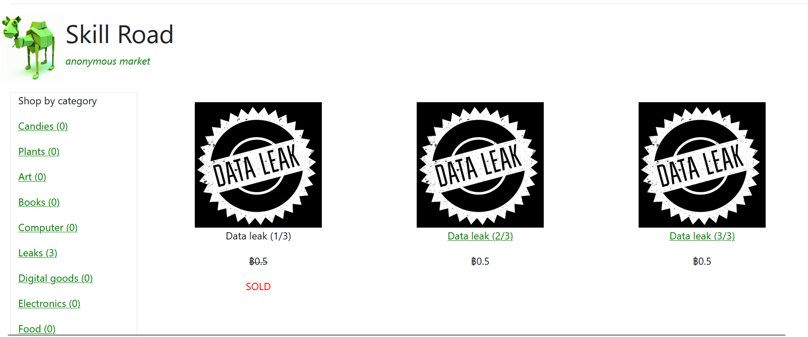

## Data leak 1/3

Une petite [IDOR](https://portswigger.net/web-security/access-control/idor) pour récuperer le premier zip. Le data leak 2/3 à l'ID 1338, donc on peut changer pour prendre l'ID 1337 et télécharger le premier fichier. 

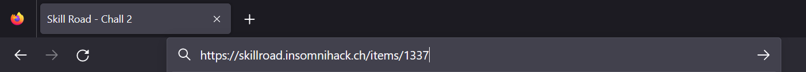

## Data leak 2/3

On trouve ces fonctions dans le js.

```js
function xor(a, b) {
    return a ^ b;
}

function add(a, b) {
    return a + b;

}
function times(a, b) {
    return a * b
}

function encrypt(pt) {
    let key = "TheKey"
    let ct = new Array();
    for(let i = 0; i < pt.length; ++i) {
        a = key.charCodeAt(i%key.length);
        b = pt.charCodeAt(i);
        switch(i%3) {
            case 0:
                ct.push(xor(a,b));
                break;
            case 1:
                ct.push(add(a,b));
                break;
            case 2:
                ct.push(times(a,b));
                break;
            default:
                break;
        }

    }
    return btoa(ct.toString())
}

// To remove after tests
// expected_ct = "MzQsMjE1LDExODE3LDQwLDIwNSwxMjIyMSwzOCwxOTksMTA1MDQsNjIsMTU2LDE0MDM2LDUwLDIwOSw3MTcxLDMxLDE3NCw2NjU1LDM4LDE1OCwxMDEwMCw0NSwyMTcsODgzMywzNCwyMjEsMTE1MTQsMTI1LDIxNSw4NDcwLDAsMjIyLDEwNjA1LDQ3LDE1NSwxNDE1Nyw5NiwxNTcsNzA3MCwyNSwxOTEsMTIxMDAsOTcsMjIxLDEwMTAwLDQ3LDIxNSwxNDE1Nw==";
```

On génère à l'aide de ChatGPT la fonction decrypt() qui déchiffre le mot de passe.

```js
function decrypt(ct) {
    let key = "TheKey";
    let pt = '';
    let arr = atob(ct).split(',');
    for (let i = 0; i < arr.length; i++) {
        let a = key.charCodeAt(i % key.length);
        let c = parseInt(arr[i]);
        switch (i % 3) {
            case 0:
                pt += String.fromCharCode(xor(a, c));
                break;
            case 1:
                pt += String.fromCharCode(c - a);
                break;
            case 2:
                pt += String.fromCharCode(c / a);
                break;
            default:
                break;
        }
    }
    return pt;
}
```

Ce qui nous donne le passwd `voucher_hu7tfiGTI7r6dftIvur6rFTvid6u45FRZd5uddru`

On peut donc télécharger le pdf de documentation du numpad

## Data leak 3/3

On reçois une erreur mysql. On essaie donc le payload basic `' OR 1=1 #`

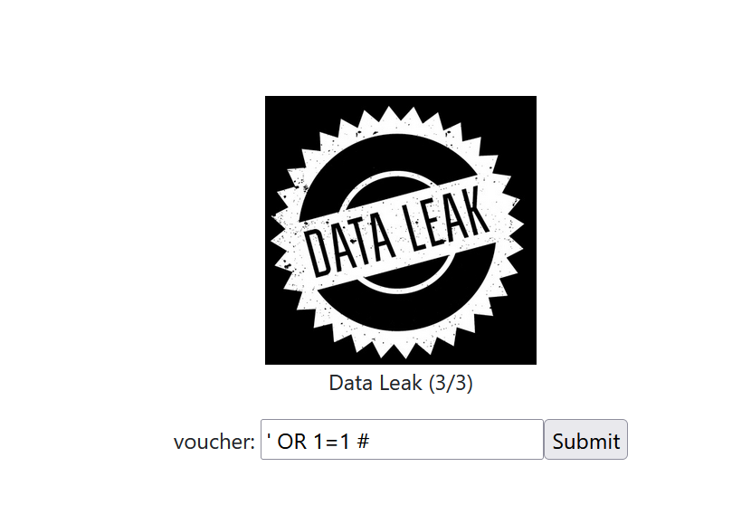

Ce qui nous permettait de download le 3ème fichier : La documentation de l'API

## Wiegand

Le premier leak qu'on à téléchargé, c'est une capture faite avec un analyseur logique. On peut l'ouvrir avec [logic 2](https://www.saleae.com/fr/downloads/). Une fois ouvert, le signal ressemblait à ça :

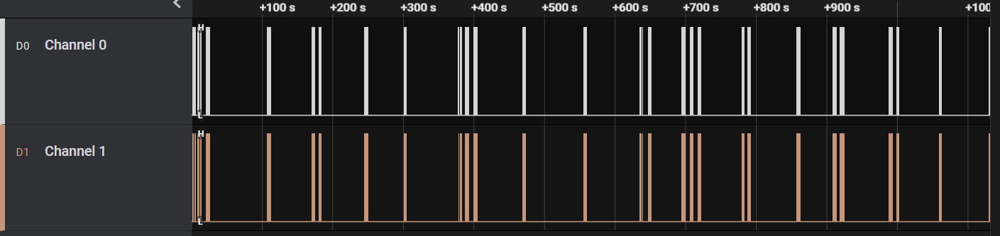Dans la documentation, on pouvais y trouver que le signal était envoyé avec le protocole Wiegand. 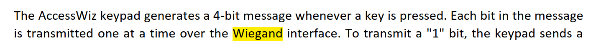

Décoder du Wiegand n'est pas possible nativement dans logic 2, mais avec [PulseView](https://sigrok.org/wiki/PulseView). Il faut exporter/importer en format CSV. 

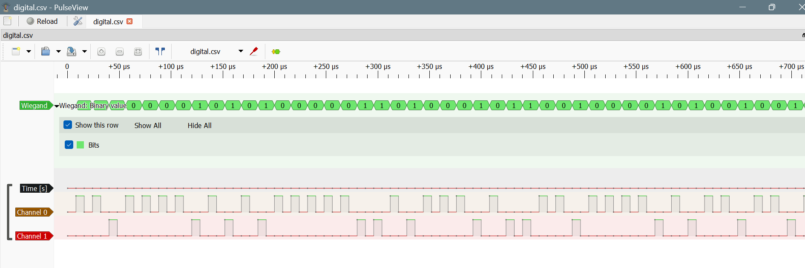

Depuis là on peut récuperer une séquence de bits. Il ne sagit pas de BCD classique, mais la table de conversion est disponible dans la documentation. 

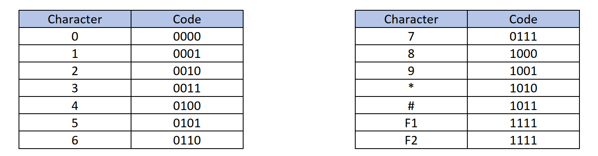
On a utilisé un script ruby pour décoder le BCD

```ruby
INVMAP = {"0000"=>"0", "0001"=>"1", "0010"=>"2", "0011"=>"3", "0100"=>"4", "0101"=>"5", "0110"=>"6", "0111"=>"7", "1000"=>"8", "1001"=>"9", "1010"=>"*", "1011"=>"#", "1111"=>"F2"}

wiegand = "001000010101000001101000101100100001010010010110100010100010000101011001011010001011001000010101100101101000101100110001010010010110100010100010000101011001011010001011001000010101100101101000101100100001010110010110100010110000000100100011010001011010101100010010100101110100001000100001010110010110100010110010000101011001011010001011001000010101100101101000101110110010000101011001011010000010000101011001011010001011001000100001010110010110100010110010001000010101100101101000101000100001010110010110100010110010000101011001100001101011001000010101100101101000101100100001010110010110100010111001011010000010000101011011001000010101100101101000101100100001001110010001100010100010000101011001011010001011001000010101100101101000101100100001010110010110100010110010000101011001011010001011001000010101100101101000101100100001010100100011101010110010000100010101000101011001011010001011001000010101100101101000101100100010000101011001011010001011001000010101100101101000101"
codes = wiegand.scan /..../
puts codes.map {|code| INVMAP[code] }.join
```

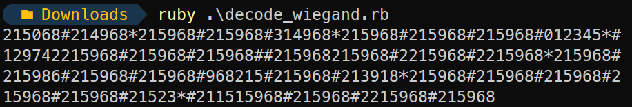

On a donc notre code et on peut ouvrir la première porte. 

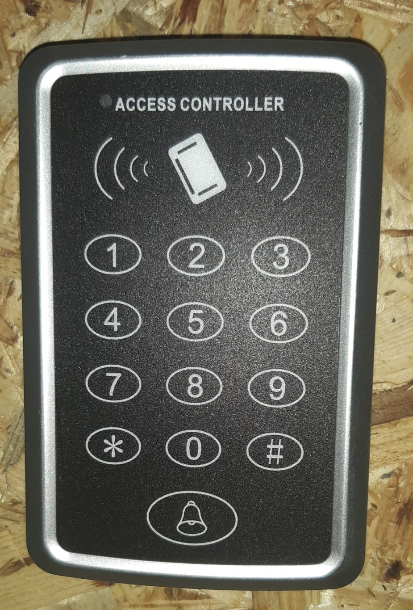

Et derrière la porte, on pouvait y trouver ce message :

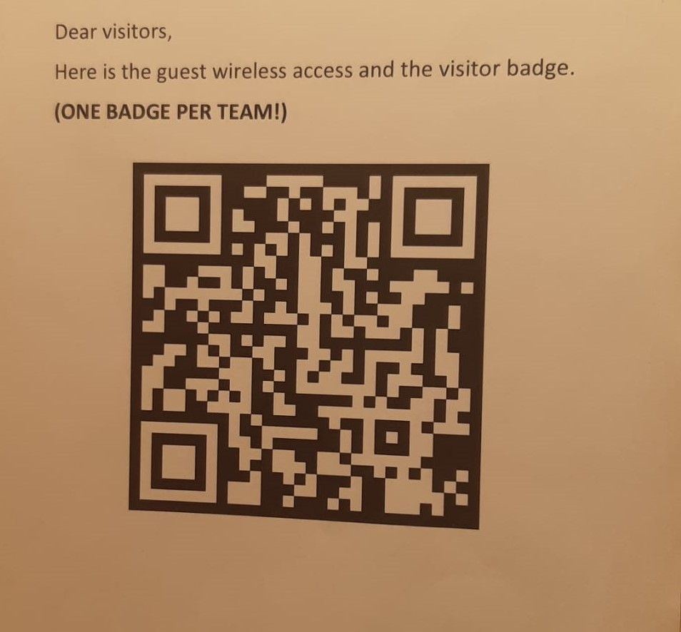

Le QRcode donnait accès au premier WLAN

```
SSID: Quest-Guest
PASS: hL98LnHXB6bwCMEUR6Z5
```


# Étape 2

## API

Dans les fichiers trouvé sur le site web, on y trouve une documentation sur une API. 

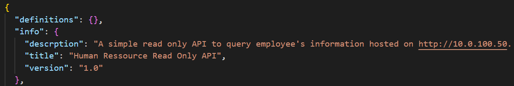

Une fonction attire notre attention :

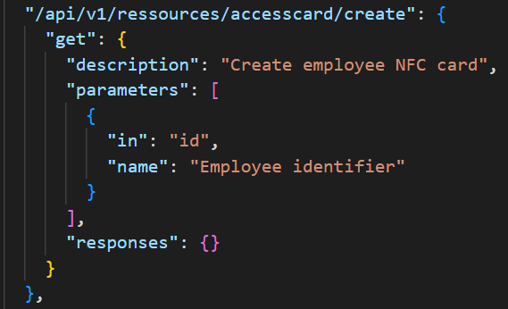

```
curl -v 'http://10.0.100.50/api/v1/ressources/accesscard/create?in=1337&name=bato'
```

Par défaut, la réponse nous dit qu'il n'y a pas de badge, on en déduit alors qu'il faut mettre le badge devant le lecteur NFC. 

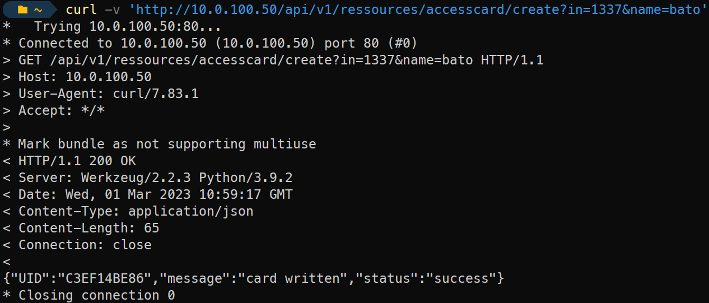

On a donc un badge écrit.

## Rewrite the NFC

A l'aide d'un [Flipper Zero](https://flipperzero.one/) ou d'un téléphone avec [Milfare Classic Tool](https://github.com/ikarus23/MifareClassicTool), on va pouvoir lire le badge.


### Read the NFC

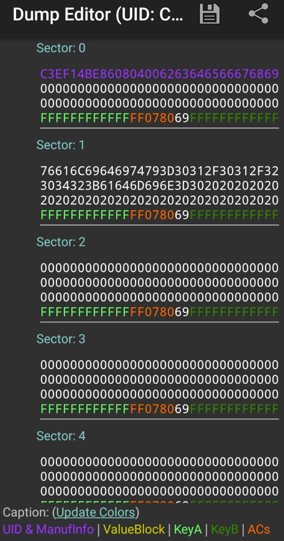

En ascii :

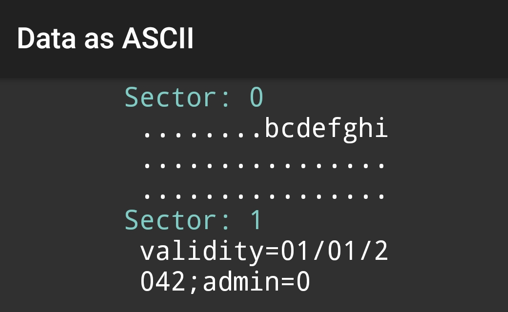

### Changer la valeur

On va changer la valeur de `admin=0` (61646D696E3D30) vers `admin=1` (61646D696E3D31) et de réécrire le secteur 1 sur le badge.  

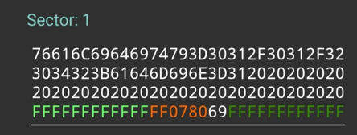

Et on peut ouvrir la deuxième porte et accéder au prochain WLAN

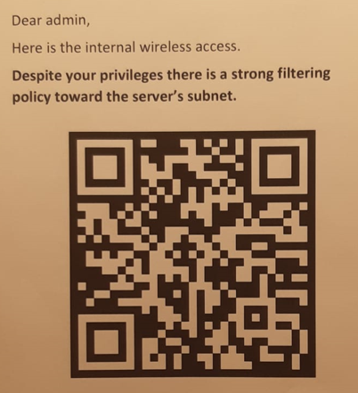

```
SSID: Quest-Internal
PASS: 32uHeleMbyRLVdqPXSg7
```


# Étape 3


## SMB share

Depuis là, il fallait trouver l'adresse d'un share smb. Après plein de scan nmap, on finit par tomber dessus à l'adresse `10.0.100.52`. Le serveur et dans le même subnet que le serveur web de l'étape 2

```
\\10.0.100.52\Confidential
```

On pouvais s'authentifier en anonymous et on y trouvais un fichier `Safe.kdbx`

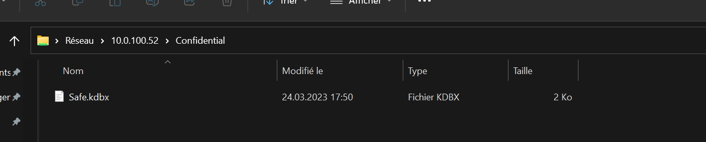

## Keepass

Il s'agit d'un de la db de mdp keepass. Après une rapide recherche google, on trouve script bash. 

https://github.com/r3nt0n/keepass4brute/blob/master/keepass4brute.sh


Le script est hyper lent, mais on arrive quand même à récuperer le mot de passe. 

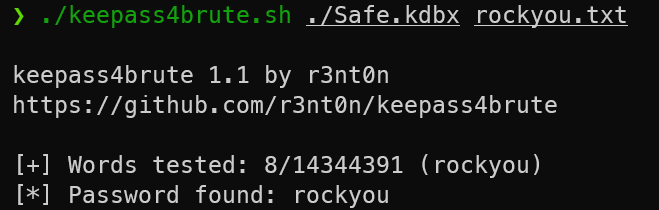

En ouvrant le fichier avec le bon mdp, on peut récuperer le flag !

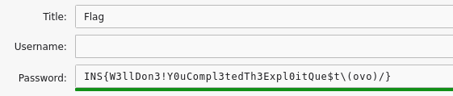


Il y avait aussi un easter egg à aller chercher à l'exterieur du batiment.

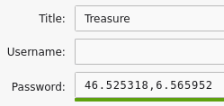


Les coordonnées mênent vers une addresse où il y avait des goodies à gagner, mais uniquement pour la première équipe. 

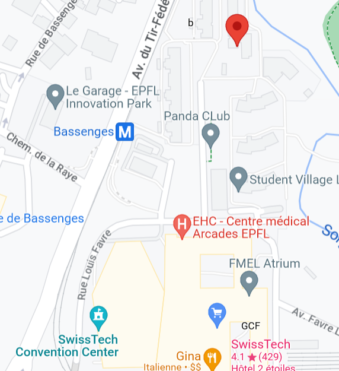
